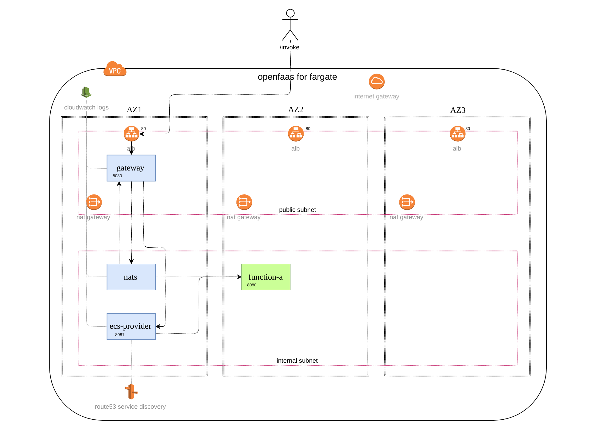

<p align="center">
  
  <h3 align="center">faas-fargate</h3>
  <p align="center">Run OpenFaaS on AWS serverless with Fargate.</p>
  <p align="center">
    <a href="https://github.com/goreleaser/goreleaser/releases/latest"></a>
    <a href="/LICENSE.md"></a>
    <a href="https://travis-ci.org/ewilde/faas-fargate"></a>
    <a href="https://github.com/goreleaser"></a>   
  </p>
</p>

---

## Installation
### Terraform deployment
_**Easy to get started**_: A [terraform module](https://github.com/ewilde/terraform-aws-openfaas-fargate) has been developed 
to build out a standard deployment of `faas-fargate` on `fargate`. See: https://github.com/ewilde/terraform-aws-openfaas-fargate.
This module deploys the whole stack on Fargate including openfaas `gateway`, `nats` and sets up default security setting
etc...

### Manually
1. Use the [published docker image](https://hub.docker.com/r/ewilde/faas-fargate/)
2. Download from the [releases tab](https://github.com/ewilde/faas-fargate/releases)

## Configuration
All configuration is managed using environment variables

| Option                            | Usage                                                                                          | Default                  | Required |
|-----------------------------------|------------------------------------------------------------------------------------------------|--------------------------|----------|
| `subnet_ids`                      | Comma separated list of subnet ids used to place function                                      | subnets from default vpc |   no     |
| `security_group_id`               | Id of the security group to assign functions. If using [terraform-aws-openfaas-fargate](https://github.com/ewilde/terraform-aws-openfaas-fargate) this is the output variable `service_security_group`                                                  |                          |   no       |
| `cluster_name`                    | Name of the AWS ECS cluster.                                                                   | `openfaas`               |   no     |
| `assign_public_ip`                | Whether or not to associate a public ip address with your function.                            | `DISABLED`               |   no     |
| `enable_function_readiness_probe` | Boolean - enable a readiness probe to test functions.                                          | `true`                   |   no     |
| `write_timeout`                   | HTTP timeout for writing a response body from your function (in seconds).                      | `8`                      |   no     |
| `read_timeout`                    | HTTP timeout for reading the payload from the client caller (in seconds).                      | `8`                      |   no     |
| `image_pull_policy`               | Image pull policy for deployed functions (`Always`, `IfNotPresent`, `Never`)                   | `Always`                 |   no     |
| `LOG_LEVEL`                       | Logging level either: `trace, debug, info, warn, error, fatal, panic`.                         | `info`                   |   no     |

## Overview


## Contributions
We welcome contributions! Please refer to our [contributing guidelines](CONTRIBUTING.md) for further information.

## Releasing
Releases are made using [goreleaser](https://github.com/goreleaser/gorelease) and use [semver](https://semver.org/)

### Example release
#### Step 1 tag the release
```
git tag v0.5.7 -m "feat: Adds verify_ssl support to environment resource"
git push origin v0.5.7
```
#### Step 2 wait for travis build to complete
Travis will:
1. build the release
1. run tests
1. push to [docker](https://hub.docker.com/r/ewilde/faas-fargate/)
1. create a github release on the [releases tab](https://github.com/ewilde/faas-fargate/releases)
